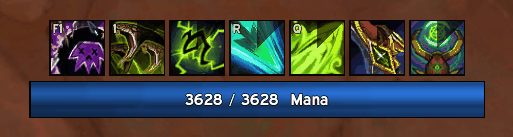
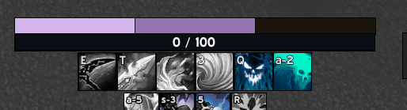
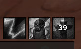

# CoA Cooldown Manager

**A retail-style Cooldown Manager for Project Ascension (WoW 3.3.5a).**
Built by **WoloUI** for the classless CoA realms.

Retail WoW got a built-in Cooldown Manager. 3.3.5 never did — you got WeakAuras, and
a weekend of writing custom Lua for every aura you wanted. CoA Cooldown Manager gives
you the same result with **dropdown menus only: never a line of code**, and it is built
from the ground up for Ascension's classless, re-ID'd, high-mutation spell system.

---

## Screenshots

**Edit mode** — every bar labelled and draggable, with the Missing Raid Buffs checklist,
the AGGRO ON YOU arrows and the OUT OF RANGE warning all live on screen:

**HoT tracking** — pick a spell, then place its indicator on the party/raid frame with the
preview grid. Test mode shows fake indicators so you can position them without a group:

---

## Why it exists

Ascension breaks most 3.3.5 addons in three specific ways, and CoACDM is designed around
all three:

- **Spell IDs change between patches.** CoACDM stores spell **names**, not IDs, by default.
  A name also follows the learned rank automatically, so nothing silently stops tracking.
  Type an **ID** instead and that exact ID is what gets tracked — which is the only handle
  that works for the custom auras this client cannot even name.
- **There are no classes.** Nothing in the addon assumes a class, a spec, or a fixed
  resource. Bars auto-detect what you actually have.
- **The API is a custom backport.** CoACDM uses Ascension's own APIs where they exist
  (`GetSpellCharges`, `UnitGetTotalAbsorbs`, `C_CharacterAdvancement`) and degrades
  gracefully where they don't.

---

## Features

### Viewers — build any bar you want

Everything you see is a *viewer* anchored in a hierarchy off the root Power bar. Ships with
Essential / Defensives / Utility / Buffs / Target DoTs / Reminders / Alerts, plus
**unlimited custom bars** of your own.

Eight display styles per bar:

| Style | What it shows |
|---|---|
| **Icons** | Cooldown sweep, charge counts, keybind text, desaturate-when-unusable |
| **Bars** | Duration status bars that drain smoothly |
| **Power** | 1–2 auto-detected resources, energy ticks, combo points |
| **Stacks** | CoA pseudo-resources as segments or a continuous bar, two auras combined (see below) |
| **Shield** | A vertical curved segment column that drains with your absorb shields — one per shield, or one `Columns: One total` for the lot |
| **Swing** | Swing timer |
| **Cast** | Cast bar |
| **Reminders** | Text alert rows |

Each bar tracks five kinds of element: **spells**, **items** (consumables),
**trinkets** (with internal-cooldown gray-out after a proc), **summons**
(pet/guardian duration timers), and **totems** (a totem slot, gray while empty). Element order in the config *is* display order, with
`^` / `v` buttons to reorder.

- Add spells four ways: drag from the spellbook onto the config panel, drop them on a
  bar in edit mode, shift+click them in the spellbook with a bar selected, or accept a
  scan suggestion. All four build the element the same way, and the bar's style decides
  what it becomes — the same spell is a cooldown on an icon row and a draining debuff on
  a duration bar.
- Power bars: per-bar text mode — current/max, current only, percent, or hidden. A resource
  counted in whole points (Souls, Ember, Felfury, Advantage) is drawn **as points**, with a
  divider per point instead of one flat fill.
- Per-bar `Timer` toggle, so target debuffs can show just their stack count.
- **Rows or columns, with a wrap.** An icon bar's `Layout` is Row or Column, `Growth` runs
  left/right (or up/down for a column) and the bar *extends that way* from where you put it
  (the stored position is the first icon's; `Center` keeps the old centre-out row), and
  `Per line` wraps the extras onto another line —
  `Overflow` says which way those lines stack. `Width mode: Match bar` measures the real
  shape, so a bar following a column is one icon wide.
- **Item families.** Comma-separate a consumable's tiers, best first
  (`Runic Healing Potion, Super Healing Potion, Greater Healing Potion`): the best one you
  actually carry leads, and the slot falls to the next as you run out. `Show` →
  **Only while carried** hides the slot entirely while you have none.
- **Apply look to all bars** copies one bar's sizes, spacing, font, growth and toggles onto
  every other bar of the same style — 20 bars no longer means setting the same three numbers
  20 times.
- **Per-icon size.** An element can carry its own `Icon size`, and the row *packs around
  it*: one 56px cooldown in a row of 32px icons pushes its neighbours over instead of
  overlapping them, and the smaller ones centre in the line. Blank = the bar's size.
- **Icon borders.** Width (none to 4px) and colour, account-wide in `General`, and both
  overridable **per icon** in the element's own settings (`Border px` + `Border` swatch,
  `Auto` clears them) — one icon can be red and 3px in a row of thin black ones, or carry
  no border at all. A Masque skin overrides all of it.
- **[Masque](https://github.com/bkader/Masque-WoTLK) support**, one skin group per bar, so
  Essentials and Utility can look different. Install it and the groups appear on their own;
  without it nothing changes.

### Triggers — conditional logic, no scripting

A base trigger plus chained conditions, all from dropdowns. Conditions can be
**cross-spell**: "show this only while *another* aura is up", "only when its stacks are
above N", "only when that other spell is off cooldown", "only while my pet is out".
Actions include **glow** and **play sound**, edge-triggered so a sound fires once on
false→true and re-arms cleanly. Pet buffs are trackable as first-class units.

**Time left (%)** is the refresh window every DoT class asks for: glow under 30% left and
one condition covers a 12-second DoT and a 30-second one. A permanent aura has no
percentage, so it never glows forever. (A stack threshold is *Stacks* with `>=`.)

**Add sound alert** writes the trigger for the three everyone wants — on aura gained, on
aura lost, on cooldown ready — and then you just pick the sound in the group it creates.

**Glow my action button** mirrors an element's glow onto the real action-bar button holding
that spell (Blizzard bars, ElvUI or Bartender4, whichever one is actually on screen). It
mirrors a glow, so the element needs a Glow condition — and because it is a *condition*, the
"warn me when it falls off" case is just *This element's aura up → Missing*. `/cdm
actionglow` says which button it resolved and why nothing is lighting up.

*This spell usable* / *Other spell usable* read `IsUsableSpell`, which is a different
question from *ready*: a spell gated by a proc or a state (CoA's Desecrate) is off
cooldown permanently and only becomes **usable** while its gate is open — so *ready*
would glow forever. Third dropdown value **Usable (ignore power)** treats "I only lack
the resource" as usable, since the gate the trigger watches is still open. Pair either
with **Silence on cooldown** when the spell also has a real cooldown. `/cdm usable
<spell>` prints what the client actually reports, including `IsUsableAction` for
comparison — run it with the gate open and closed; if nothing changes, the client can't
see that gate and you want *Other aura active* on the enabling buff instead.

### HoT / buff tracking on your existing unit frames

Draws your **own** heal-over-time and buff indicators directly onto your ElvUI or Blizzard
party/raid frames — 9 anchor points with offsets, icon or colour square, and per-spell
time / sweep / stacks / blink options.

This is the part that took the most engineering. Frames are discovered by *walking* the
real frame children and mapping by `IsVisible()` (ElvUI leaves hidden raid headers
reporting `IsShown() == true`, which silently splits your map across two headers in a
34-man raid). Indicators require `aura.mine`, matching ElvUI's own oUF_AuraWatch
ownership rule, so you never light up on another healer's HoTs — with an opt-in
`anyCaster` checkbox per indicator when you *do* want that.

### Screen overlays

Standalone, account-wide, draggable in edit mode, each with an optional edge-triggered sound:

- **Missing Raid Buffs** — a row of icons for every raid buff category you're missing.
  16 categories / 137 buff names, generated from the community "CoA Buff Reminders"
  WeakAura. Hidden in combat by default: it's a pre-pull checklist, not a nag.
- **Aggro Alert** — "AGGRO ON YOU" with arrows when you take threat in combat.
- **Range Alert** — "OUT OF RANGE" when your target is outside melee reach. 3.3.5 has no
  `UnitInMeleeRange`, so this probes `IsSpellInRange` against your configured spell, then
  Auto Attack, then any short-range spell in your book — and stays silent rather than
  lying when the client can't tell.

### Reminders

Aura-by-ID and weapon-enchant reminders with custom text, recomputed on a 0.3s tick.

### Edit mode & appearance

Drag every bar with 12px magnet snapping to other bars and to screen centre. A movable
**ExtraActionBar** (bar and individual buttons). LibSharedMedia fonts and textures
(consumed if another addon provides it, never embedded), font scaling, frame strata
selector, and five glow styles — proc flipbook, pixel, pulse, shine, solid — with a
colour picker.

**GCD sweep** (per icon bar, off by default) runs the global cooldown sweep on that bar's
icons, but only while the GCD outlasts the spell's own cooldown — the same rule WeakAuras
uses, so icons stay readable instead of flickering on every cast. **GCD time** adds the
countdown on top of it.

### Pseudo-resources, two auras at a time

CoA resources often come as a pair of auras. The Reaper is the clean example: **Reaped Soul**
is the resource you spend, and **Soul Fragment** stacks to 3 — then converts into one Reaped
Soul — and *expires* on its own.

A Stacks bar shows both at once. Whole segments come from the main aura; a second "filling
aura" paints the segment in progress, a third at a time, and with **Drain on expiry** that
sliver empties right to left as the fragment buff runs out — so souls about to be lost are
visibly leaving. The optional **gradient** shades that sliver by how many sub-resources it
holds — pale at one fragment, saturated at the last one before it converts — while whole
segments always keep the configured colour, since every one of them is the same thing.
**Subdivide** draws the sub-stack divider lines inside every segment for anyone who would
rather count cells than read a sliver.

### Totem tracker

Totems are read from the *slots* rather than a spell list, so whatever this server plants
there — a shaman's four totems, a Witch Doctor's idols, wards and effigies — shows up with
its own icon, name and timer. `/cdm totems` prints what the client reports per slot.

Add a **Totem** element to any icon bar: sweep and time left while the totem stands, and a
**gray icon while it does not**, so an empty slot still tells you what to re-plant. Pick a
slot — the icon and the totem's real name are learned the first time you plant one, and
until then the placeholder borrows whatever your totem bar has on that slot — or match by
the totem's name instead.

Totems with their own cooldown sweep it on the gray icon, so you can see when the re-plant
is coming up rather than just that it's gone — which is the whole story for something like
Stasis Ward, up for 2 seconds and cooling for 45. The planting spell is resolved
automatically (your totem bar's spell for that slot, then the totem's own name); there's an
optional field for it when the two names differ.

Being ordinary elements, they take the whole trigger builder, so a **glow or a sound** is
two dropdowns away:

- *This totem up* = **standing / down**, so you can glow or beep for the whole time the
  totem is doing its job.
- *This totem is* = **which** totem is standing, by name. A slot holds different totems over
  time, so this is how you aim a trigger at one of them — or, with the *Show only if*
  action, make the element show up for that totem only.
- *This spell ready* = **can be planted now** (down *and* off cooldown) — the actionable
  re-plant alert. Not "while it's down", which on a 2s/45s totem would fire almost
  permanently.
- *Time left* is the **totem's** own remaining time, 0 while it's down, never the
  cooldown's.

If the totem's *effect* outlives the totem itself, track that buff with an
*Other aura active* condition instead.

### Class HUD hider

An on-screen picker that hides CoA's built-in class HUDs (resource orbs and friends):
hover, left-click to hide, right-click to cancel. Per-profile, and re-hides on show.

### Profiles

Config is **per character**, which is what you actually want on a classless server —
layouts live per character so anchors never bleed between alts. Named profiles are
account-wide **templates**, loaded *by copy* on assignment: deleting a template never
touches the character copies that came from it. Bar **positions travel with the template**
and are restored when you load it into the spec you are playing. Import/export via `!CDM1!` base64
strings, parsed by a hand-written token parser (never `loadstring`).

### Spell scanner

Run it when you want (`/cdm scan` or the panel button). Reads the tooltip of every active
spell and hands you a scrollable, searchable suggestions window: pick which of *your* bars
each spell should go to, or dismiss it.

**One suggestion per spell, not per rank.** The spellbook lists every learned rank as its
own slot; the scan keeps one row per name and follows the highest rank. On a real Pyro
spellbook that is 100 of 159 slots collapsed away.

**Filtering is per spellbook tab**, because that is what actually separates junk from
abilities on this server: racials, PvP toggles, mounts and hearthstones live in the general
tab and Ascension's toys in its own *Ascension Vanity Items* tab, while real spells live in
the specialization tabs. Both junk tabs are unticked by default and every tab gets a
checkbox, read live from the client so the names always match your spec.

> A note for anyone tempted by `C_CharacterAdvancement`: it is **not** a usable
> "is this a class ability" signal here. It answers for only a fraction of spells — on a
> live Pyro, Eruption and Spellburn read as non-CA while sitting on the player's own bars.
> The optional `Only class/spec spells` toggle uses it, off by default, and asks every rank
> because the CA entry is registered against the base rank only.

**Cooldowns are not the only thing worth a bar.** Plenty of spec spells have no cooldown
line at all, so the scan also reads aura durations (`for 19 sec`) and suggests those as
target DoTs or self buffs on a duration bar. A spell with neither a cooldown nor a duration
has nothing a bar could show, and is left alone.

Spells you dismiss with `X` stay dismissed, even across a manual scan, and the General page
lists them so you can put one back. Two diagnostics, because tooltip wording and the
client's own spell data cannot be inspected outside the game: `/cdm scan debug` prints a
per-tab summary and why each spell was kept or dropped, and `/cdm scan tip <spell>` dumps a
raw tooltip line by line next to the cooldown it parsed.

---

## Installation

1. Extract the `CoACooldownManager` folder into
   `Interface/AddOns/`.
2. **Fully restart the game client.** Not `/reload` — the addon loads new files, and
   3.3.5 only reads the `.toc` at startup.
3. Type `/cdm`.

Optional but recommended: ElvUI (unit-frame tracking + skinning) and LibSharedMedia.

## Commands

| Command | Does |
|---|---|
| `/cdm` | Open the config panel |
| `/cdm edit` | Toggle edit mode (drag bars) |
| `/cdm test` | Test mode — fills bars with fake data so you can position them solo |
| `/cdm scan` | Run the spell scanner |
| `/cdm debug` | Dump unit-frame mapping and cached auras (tracking triage) |
| `/cdm range` | Print melee-range probe candidates and raw results |
| `/cdm gcd` | Show which global-cooldown probe answers on this server |
| `/cdm usable <spell>` | Print `IsUsableSpell` / `IsUsableAction` for a spell (proc-gate triage) |
| `/cdm totems` | Dump every totem slot's raw contents |
| `/cdm trinket` | Trinket diagnostic |
| `/cdm actionglow` | Why an action-bar glow is or is not firing (which button it resolved) |
| `/cdm aura <name>` | Why an aura is or is not matching, per unit |
| `/cdm power` | Every power index the client answers for (is this resource an aura?) |
| `/cdm spellbook` | Which resolver answers for spellbook drag/shift+click |
| `/cdm scale <n>` | Config-window scale, the way back from one too small to use |
| `/cdm minimap` | Toggle the minimap button |
| `/cdm reset` | Reset positions |
| `/cdm resetextra` | Reset the ExtraActionBar position |

Minimap button: **left-click** config, **right-click** edit mode, **drag** around the rim.

---

## Support

This addon is free, and it stays free. It was built raid night by raid night, on feedback
from people who kept telling me what was still annoying — and it's better for it.

If it saved you a weekend of writing WeakAuras, or just made your healing feel good, you can
buy me a coffee at **[ko-fi.com/woloui](https://ko-fi.com/woloui)**. Completely optional and
genuinely appreciated. ☕

Either way, thanks for playing with it. Bug reports and ideas are worth just as much.
